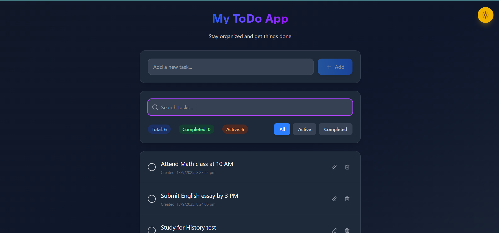
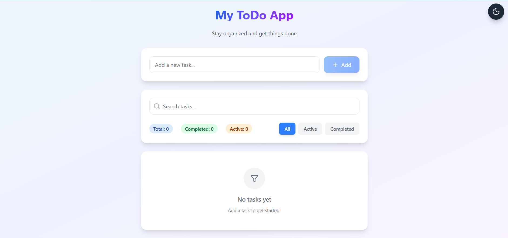
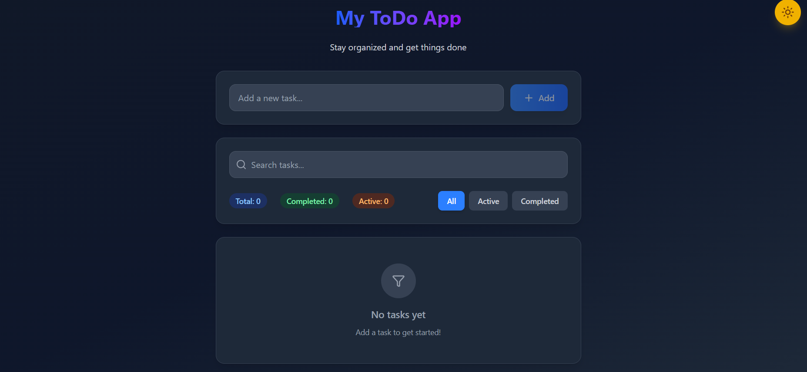

# 📝 My ToDo App

A modern, feature-rich **Todo Application** built with **React + Tailwind CSS**.
Stay organized, manage tasks, and enjoy a sleek **dark/light mode** UI with search and filters.

---

## 🚀 Features

* ✨ **Add, Edit, Delete Todos** – Manage your tasks effortlessly.
* ✅ **Mark as Completed** – Toggle tasks between active and completed.
* 🔍 **Search & Filter** – Quickly find tasks by keyword or status.
* 🎨 **Dark/Light Mode** – Beautiful gradient UI with theme toggle.
* 📊 **Task Stats** – Shows total, completed, active, and searched tasks.
* 🗑️ **Clear Completed** – Remove all completed tasks with one click.
* ⚡ **Keyboard Shortcuts** – Press **Enter** to add or save tasks quickly.

---

## 📸 Screenshots


### Light Mode



### Dark Mode



*(Add screenshots after running your app and uploading images to your repo or an image host)*

---

## 🛠️ Tech Stack

* **React** (functional components + hooks)
* **Tailwind CSS** (modern UI styling)
* **Lucide React Icons** (for beautiful icons)

---

## 📂 Project Structure

```
TodoApp/
│-- src/
│   ├── components/
│   │   └── TodoApp.jsx
│   ├── App.js
│   ├── index.js
│   └── ...
│-- package.json
│-- tailwind.config.js
│-- README.md
```

---

## ⚡ Installation & Setup

1. Clone this repository:

   ```bash
   git clone https://github.com/your-username/todo-app.git
   cd todo-app
   ```

2. Install dependencies:

   ```bash
   npm install
   ```

3. Start development server:

   ```bash
   npm start
   ```

4. Open in browser:

   ```
   http://localhost:3000
   ```

---

## 📌 Usage

* Type a task in the input field and **press Enter** or click **Add**.
* Click the **checkbox** ✅ to mark tasks as completed.
* Use **Edit ✏️** and **Delete 🗑️** to manage tasks.
* Switch between **All / Active / Completed** filters.
* Use the **search bar 🔍** to quickly find tasks.
* Toggle **Dark 🌙 / Light ☀️** mode anytime.

---

## 🔮 Future Improvements

* 📱 Responsive mobile-first improvements
* ⏰ Due dates & reminders
* 💾 LocalStorage / Database persistence
* 🏷️ Categories / Tags for tasks

---

## 🤝 Contributing

Pull requests are welcome! If you’d like to add features or fix bugs:

1. Fork this repo
2. Create a feature branch (`git checkout -b feature-name`)
3. Commit changes (`git commit -m "Added new feature"`)
4. Push and open a PR

---

## 📄 License

This project is licensed under the **MIT License** – free to use and modify.

---